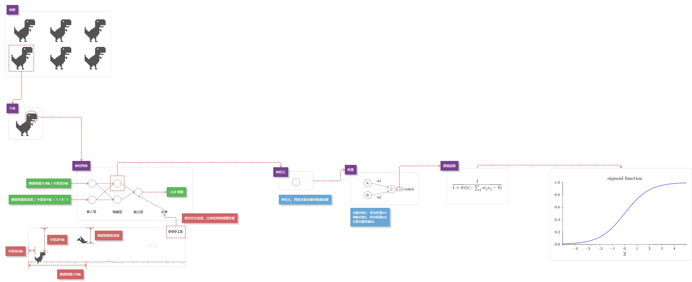

# Neuroevolution_T-rex

用神经网络来训练个能自己玩chrome断线时的那个小恐龙的AI

## 游戏本体（t-rex-runner）

游戏本体叫“t-rex-runner”，源码来自这里[https://github.com/wayou/t-rex-runner](https://github.com/wayou/t-rex-runner)。

下称“小恐龙游戏”。

## 我对游戏的修改

0. 删除了音乐（因为我电脑卡）
0. 移除了当焦点不在浏览器上就暂停游戏的监听（因为我要边写代码边看小恐龙）
0. 游戏的本体代码在 game.js 和 game.html （因为这样我可以通过iframe来控制多个同时运行的游戏）

## 关于人工智能或者神经网络或者机器学习

主要实现这些“智能”的类库来自于 Neuroevolution.js ，这个文件来自于[https://github.com/xviniette/FlappyLearning](https://github.com/xviniette/FlappyLearning)。

经过一段时间的分析，整理了这样思路，大概看懂了神经网络的学习原理，还有遗传算法

```
结构关系图
    - 种群
        - 世代 * n
            - 基因 * n
                - 得分
                - 神经网络
                    - 神经层 * n
                        - 神经元 * n

```



## 关于如何控制小恐龙游戏

看 index.js 你就会明白，我循环创建了几个iframe，一个iframe一个小恐龙游戏。
对每一个iframe进行操作，把小恐龙游戏的数据传递给AI，再把AI判断的结果换成操作并让小恐龙跳起来。

## 关于这个项目要怎么开始跑

0. 为了让iframe能避开安全沙箱（跨域什么的），从而实现index.js对iframe里面的上下文进行操作，因此你要开启web服务器，我用的是nodejs的一个叫“http-server”，因此你会看到我的目录下有个启动脚本“startServer.bat”吗，双击启动就行了（如果你是window的电脑的话），然后访问127.0.0.1:8080。
0. 页面运行的时候会创建50个iframe来跑小恐龙，由于我的电脑比较卡，因此setTimeout了10秒才启动小恐龙游戏，所以你看到50个小恐龙一动不动的时候不要慌张。当然你电脑强的话可以把50改成500。
0. 当所有小恐龙游戏结束的时候才会重新开始，所以死剩最后一个小恐龙的时候不要慌，而且重新开始之后AI并不会删除之前的训练数据（反正我不知道训练数据在哪里，你自己找找看），因此每次死完之后的重生，AI就更加聪明一筹。

## 关于如何保存和载入训练之后的AI

如何保存：当所有小恐龙游戏结束的时候，就会把神经网络结构保存进localStorage中，名为“Neuroevolution_T-rex”。

如何加载：页面刷新的时候（摁F5），就会把localStorage中getItem("Neuroevolution_T-rex")，如果有内容，就加载进当前的神经网络中。